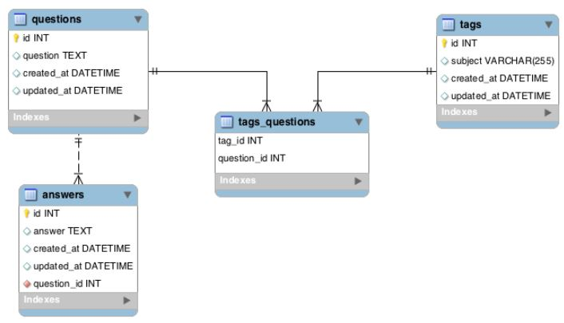
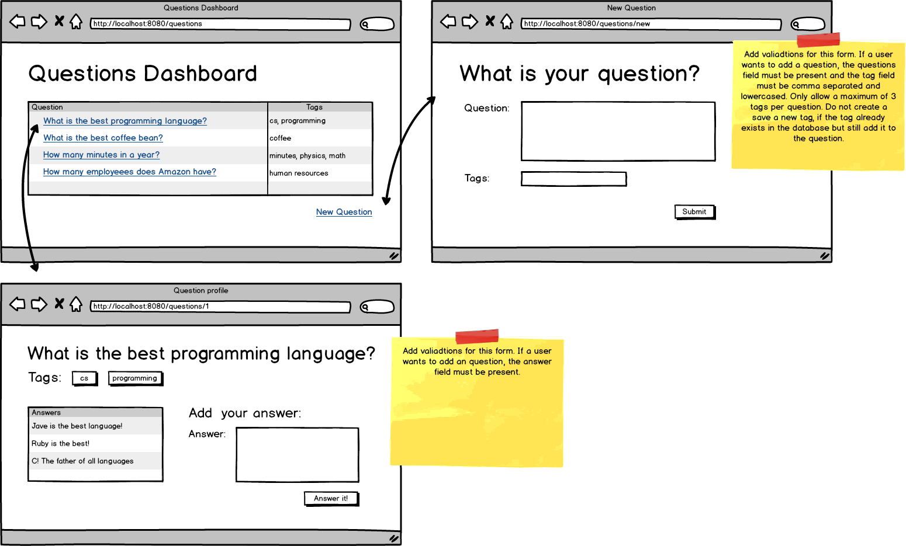

# Java_Dojo_Overflow
A Java clone of StackOverflow / Quora. Users will be able to create questions, answers, and add tag subjects for the questions.

<h2>Topics:</h2>

● Relationships

● Validations

● Domain Models

● JPA methods

<h2>Tasks:</h2>

● Have the question dashboard display each question and their tags.

● Allow users to create questions with tags and implement validation errors.

● Allow users to answer questions and implement validation errors.

● Have the question show page display all the answers for that specific questions.

<h2>ERD and Wireframe</h2>

